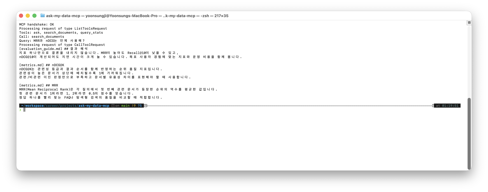

# Ask-My-Data MCP

> 하나의 자연어 질문을 **의미 검색(RAG)** 과 **데이터 집계(Text2SQL)** 경로로 자동 라우팅해 답하는 MCP 서버.
> LangGraph 기반 Multi-Agent 파이프라인을 **완전 합성 검색 평가 데이터**로 검증하는 포트폴리오 프로젝트입니다.

## 실행 증거

아래 이미지는 2026-07-15에 클린 가상환경에서 MCP stdio 연결 후 `tools/list`와
`search_documents`를 실제 호출한 결과입니다.



| 검증 | 결과 |
|---|---|
| `pip install -e ".[dev]"` | 통과 (Python 3.14.5) |
| `python -m pytest -q` | 6 passed |
| MCP initialize · tools/list | 통과 — 3 tools |
| `search_documents` 호출 | 통과 — API 키 없이 BM25 검색 |

`ask`와 `query_stats`는 라우팅·SQL 생성·답변 합성에 Claude를 사용하므로
`ANTHROPIC_API_KEY`가 필요합니다. 위 smoke test는 키나 외부 API 없이 검증 가능한 검색 경로입니다.

동일한 검증은 `python scripts/smoke_test.py`로 재현할 수 있습니다.

## 무엇을 보여주나
- **MCP 서버** — 범용 LLM 클라이언트(Claude Desktop 등)에서 도구로 호출
- **Multi-Agent 라우팅** — 질문 유형(`semantic`/`structured`/`both`)을 판단해 경로 분기
- **RAG** — BM25 키워드 + (옵션)다국어 임베딩 Hybrid Search
- **Text2SQL** — 자연어 → 검증된 SELECT → 검색 실험 결과 집계
- **Synthesize** — 문서 근거와 정형 결과를 결합한 답변 생성

## 아키텍처

```
          ┌──────────┐
질문 ────▶ │  Router  │  semantic / structured / both 분류
          └────┬─────┘
       ┌───────┼────────┐
       ▼                ▼
  ┌─────────┐     ┌───────────┐
  │  RAG    │     │ Text2SQL  │
  │ (문서)   │     │ (SQLite)  │
  └────┬────┘     └─────┬─────┘
       └────────┬───────┘         (both: RAG → Text2SQL 순으로 이어붙임)
                ▼
         ┌────────────┐
         │ Synthesize │  근거 종합 → 자연어 답변
         └────────────┘
```

## 검색 실험용 합성 데이터

`data/`는 특정 회사·고객·서비스와 무관하게 이 프로젝트를 위해 새로 만든 데이터입니다.

| 구성 | 내용 | 실험 질문 예시 |
|---|---|---|
| 문서 코퍼스 | 검색 지표·방법론 + 실시간 협업 편집 OT/CRDT 기술 문서 | “MRR과 nDCG의 차이는?”, “OT와 CRDT는 언제 선택해?” |
| `datasets` | 언어·질의 수·문서 수가 다른 가상 데이터셋 3개 | “다국어 데이터셋은 무엇인가?” |
| `experiments` | BM25·Dense·Hybrid-RRF 가상 실험 9개 | “MRR이 가장 높은 실험은?” |
| `experiment_results` | 데이터셋과 실험을 결합한 조회용 View | “한국어 데이터셋의 품질·지연 시간 비교” |

모든 이름, 설명, 지표와 지연 시간은 검색/RAG 실험을 위해 임의로 구성한 합성 값입니다.
실시간 협업 편집 문서는 사용자가 제공한 일반 기술 리서치 문서로, 합성 실험 수치와 분리되어 있습니다.

## 빠른 시작

```bash
# 1) 설치
python -m venv .venv && source .venv/bin/activate
pip install -e ".[dev]"          # 기본 + 테스트
pip install -e ".[embeddings]"   # 옵션: 다국어 임베딩 Hybrid Search

# 2) 환경변수
cp .env.example .env              # ANTHROPIC_API_KEY 채우기
export $(cat .env | xargs)        # 또는 direnv/python-dotenv

# 3) 합성 검색 실험 DB 생성
python data/build_sample_db.py

# 4) MCP 없이 바로 테스트 (CLI)
python -m src.cli "MRR이 뭐야?"
python -m src.cli "Mosaic 데이터셋에서 MRR이 가장 높은 실험은?"
python -m src.cli "nDCG@10이 가장 높은 실험은 무엇이고, nDCG는 어떻게 계산해?"

# 단위 테스트
python -m pytest -q
```

## MCP 클라이언트에 연결 (Claude Desktop 예시)

`claude_desktop_config.json`:
```json
{
  "mcpServers": {
    "ask-my-data": {
      "command": "python",
      "args": ["/absolute/path/to/ask-my-data-mcp/server.py"],
      "env": { "ANTHROPIC_API_KEY": "sk-ant-..." }
    }
  }
}
```
노출 도구: `ask` (자동 라우팅) · `search_documents` (RAG) · `query_stats` (Text2SQL)

## 예시 질문과 라우팅
| 질문 | 라우팅 | 경로 |
|---|---|---|
| "MRR이 뭐야?" | semantic | RAG |
| "Mosaic 데이터셋에서 MRR이 가장 높은 실험은?" | structured | Text2SQL |
| "nDCG@10이 가장 높은 실험은 무엇이고, nDCG는 어떻게 계산해?" | both | RAG + Text2SQL |

## 기술 스택
`Python` · `MCP` · `LangGraph` · `Anthropic Claude` · `rank-bm25` · `sentence-transformers(옵션)` · `SQLite`

## 관련 글
- [하나의 프롬프트로는 안 됐다 — LangGraph Multi-Agent 라우팅](https://feelgom.github.io/blog/blog/langgraph-multi-agent-routing/)
- [70%짜리 검색으로 90%짜리 경험을 만드는 법](https://feelgom.github.io/blog/blog/rag-evaluation-user-experience/)

## 라이선스
MIT
